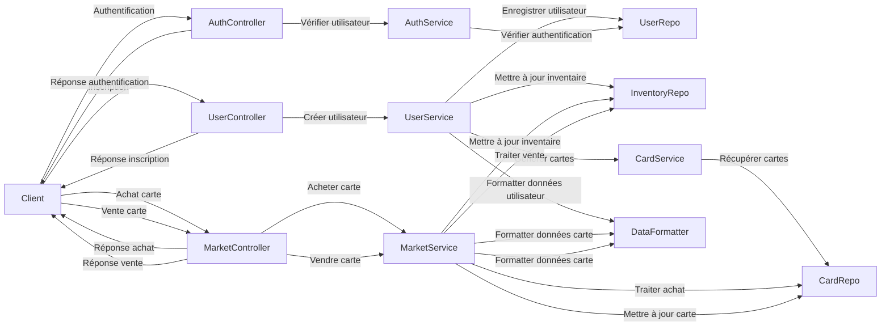
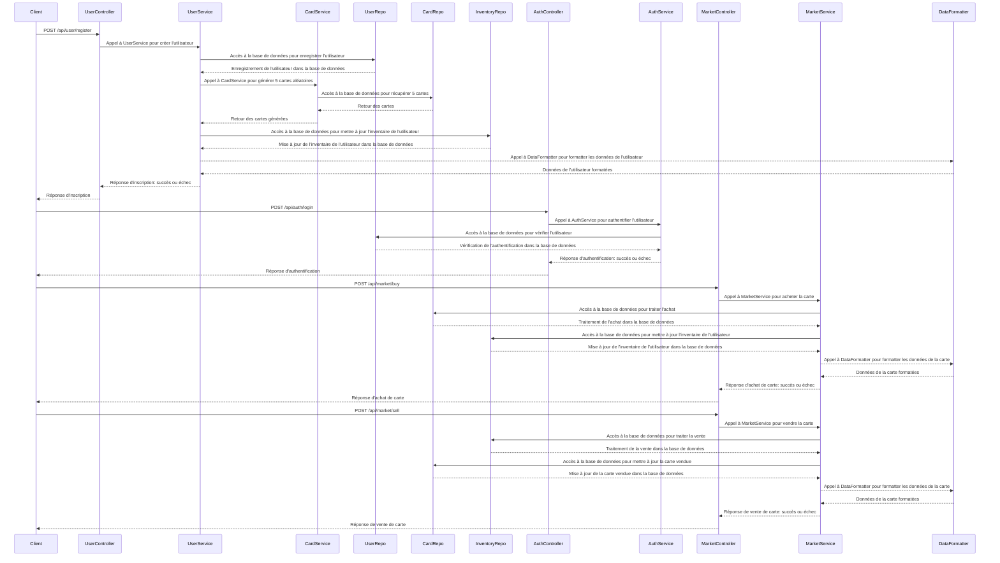

# Atelier2-SpringBoot

## Autors :

HADJ-HAMDRI Mohammed-Amine
ROUET Liam
PHENG Julien

## Lien Gitlab

https://gitlab.com/cpelyon/4eti-2023-2024/groupe-3/Atelier2-SpringBoot

## Concepts :
Différentes architectures de conception logicielle
- MVC
- SOA
- MicroService

Avantages/inconvénients des architectures
- Services Web Full Rest
- Gestionnaires de dépendances (basique)

Techno :
- Maven
- Spring boot
- Javascript, AJAX

## Schéma de l'Architecture (haut niveau) :

## Schéma de l'Architecture (bas niveau) :

## Architecture Logicielle:

Frontend (JavaScript + AJAX) :
- Utilisera JavaScript pour la logique client.
- Les appels AJAX seront utilisés pour communiquer avec les services Web REST côté serveur.
- Interface utilisateur (UI) pour l'inscription, la connexion, l'achat et la vente de cartes.

## Backend (Spring Boot) :
Controllers :
- AuthController : Gère les requêtes liées à l'authentification des utilisateurs.
- MarketController : Gère les requêtes liées à l'achat, la vente ainsi que la génération des cartes.
- UserController : Gère les requêtes liées à l'inscription des utilisateurs.

Models :
- AppUser : Permet de créer un nouvel utilisateur avec ses données.
- Card : Permet de créer une nouvelle carte avec ses données.
- DataFormatter : Permet de récupérer les informations d'un utilisateur sans avoir à utiliser son mot de passe.
- Inventory : Permet de créer un nouvel inventaire avec ses données.

Repositories :
- CardRepo : Base de données contenant les informations concernant les cartes dans le market.
- InventoryRepo : Base de données contenant les informations concernant les cartes détenues par un utilisateur.
- UserRepo : Base de données contenant les informations des utilisateurs.
  
Services :
- AuthService : Gère la logique métier pour la gestion de l'authentification des utilisateurs.
- CardService : Gère la logique métier la création et la génération de cartes.
- ImgGeneratorService : Gère la logique métier pour la génération de l'image des cartes via l'API prédéfinie dans le cours.
- MarketService : Gère la logique métier pour l'achat et la vente de cartes.
- PromptGeneratorService : Gère la logique métier pour la génération de la description des cartes via l'API prédéfinie dans le cours.
- UserService : Gère la logique métier pour la création d'utilisateurs.

## Avantages et Inconvénients de l'Architecture :
Avantages :
- Une structure bien organisée avec une séparation claire des préoccupations.
- Les controllers agissent comme des points d'entrée pour les requêtes HTTP et délèguent le travail aux services.
- Les services contiennent la logique métier, ce qui rend le code facilement testable et évolutif.
  
Inconvénients :
- Une gestion précise des dépendances entre les composants est nécessaire pour éviter les problèmes de dépendances circulaires.

## Détails de l'Implémentation :
- AuthController : 
  Endpoint pour l'authentification (POST /api/user/login).

- UserController :
  Endpoint pour l'inscription (POST /api/user/register).

- MarketController :
  Endpoints pour acheter (POST /api/card/buycard), vendre (POST /api/card/sellcard) et générer (POST /api/card/generateCards) des cartes.

- AppUser : 
  Modèle pour générer les informations de l'utilisateur. (Username, Password, Email, Wallet)

- Card : 
  Modèle pour générer les informations de la carte. (Name, Image, Description, Price)

- DataFormatter : 
  Modèle pour récupérer les informations d'un utilisateur sans mot de passe. 

- Inventory : 
  Modèle pour gérer l'inventaire de l'utilisateur. 

- AuthService :
  Méthode pour authentifier un utilisateur (checkLogin).

- CardService :
  Méthodes pour créer (createCard) et générer automatiquement des cartes (generateCards).

- ImgGeneratorService :
  Méthode pour générer l'image des cartes (generateAllImages).

- MarketService :
  Méthode pour créer acheter (buyCard), vendre (sellCard) des cartes.

- PromptGeneratorService :
  Méthode pour générer la description des cartes (generateAllPrompts).

- UserService :
  Méthode pour créer un utilisateur (registerUser).

## Questions :
1. Qu’est ce que des Services Web Full Rest ? Quelles sont les contraintes imposées par ce type de service ?

> *Ce sont des services web qui suivent les principes architecturaux de REST (Client-serveur, Sans état, Cacheable, Système à plusieurs niveaux, interface uniforme).*

> *Il y a tout d'abord la contrainte de respecter les principes cités ci-dessus donc que l'interface soit uniforme et simple et assurer la gestion de l'état du client et l'état du cache.*

2. Qu’est ce qu’un gestionnaire de dépendance ? Maven est-il le seul ? Quel est l’avantage d’utiliser un
gestionnaire de dépendances ? Quelles sont les grandes étapes de fonctionnement de Maven ?

> *Un gestionnaire de dépendance c'est un outil qui gère les bibliothèques, les frameworks et les autres composants logiciels dont le projet a besoin pour fonctionner correctement et gère les eventuels conflits entre ces derniers.*

> *Maven n'est pas le seul gestionnaire de dépendances mais pour du Java, c'est le gestionnaire le plus utilisé.*

> *Le gestionnaire de dépendances facilite grandement la gestion de ces dernières dans un projet car si les développeurs devaient gérer eux-mêmes les dépendances, ce serait sujet à beaucoup plus d'erreurs.*

> *Les 4 grandes étapes de fonctionnement de Maven sont: la création du projet, le téléchargement des dépendances, la compilation et l'empaquetage du projet et le déploiement du projet.*

3. Qu’est ce qu’une application classique Entreprise Java Application ? Donner un exemple d’usage avec
web service, JSP, JavaBean, EJB et JMS.

> *Une application classique Entreprise Java Application est une application ditribuée qui utilise la plateforme Java EE pour obtenir des fonctionnalités spécifiques d'entreprise telles que la sécurité, la gestion des transactions, la messagerie et l'intégration avec d'autres systèmes d'entreprise.*

> *Prenons l'exemple d'une boutique en ligne: l'utilidateur client peut parcourir un catalogue de produits, de passer des commandes et de suivre l'état de leurs commandes à travers l'application (web-service) ensuite la création dynamique des pages HTML se fait via JSP qui va utiliser les données stockées dans les JavaBeans où sont contenues les informations sur les produits, les commandes et les clients de la boutique en ligne. Lorsqu'un client passe une commande, l'application utilise un EJB pour gérer la transaction et mettre à jour les données d'entreprise. C'est l'EJB qui gère si la transaction est valide et met à jour le catalogue quand la transaction s'effectue. Et enfin, JMS s'occupe d'envoyer des notifications aux clients concernant l'évolution de l'état de leurs commandes.*

4. Qu’est ce que Spring ? Qu’apporte Spring boot vis-à-vis de Spring ?

> *Spring est un framework open source pour le développement d'applications Java qui fournit une large gamme de fonctionnalités qui aident au développement d'applications d'entreprise.*

> *Spring boot est un projet qui facilite le développement d'applications Spring. C'est un outil qui permet de créer plus rapidement une application Spring via une configuration par défaut, des dépendances prédéfinies et des outils de développement intégrés.*

5. Qu’est ce que Spring Boot ? Quels sont les points communs/différences entre JEE et Spring Boot ?

> *Spring boot est un projet qui facilite le développement d'applications Spring.*

> *Spring Boot et Java EE sont tous deux utilisés pour le développement d'applications d'entreprise en Java, mais ils présentent des différences importantes en termes d'architecture, de complexité, de configuration, de dépendances et d'outils de développement. Les développeurs peuvent donc choisir la plateforme qui convient le mieux à leur projet.*

6. Qu’est ce qu’une annotation ? Quels apports présentent les Annotations ?

> *Une annotation est une métadonnée qui fournit des informations supplémentaires sur l'élément du code.Les annotations sont utilisées dans les frameworks et bibliothèques Java.*

> *Une annotation permet de simplifier le code, améliorer sa lisibilité ainsi que sa flexibilité et d'intégrer l'application avec d'autres outils de développement.* 

7. Comment fait-on pour créer un Web Service Rest avec Spring Boot ?

> *Pour créer un Web Service Rest avec Spring Boot, il faut créer un projet Spring Boot, créer une classe de contrôleur, définir les méthodes de la classe de contrôleur, démarrer l'application et tester le Web Service REST. Spring Boot se chargera de fournir des fonctionnalités pour simplifier le développement de Web Services REST.*

8. Qu’est ce qu’un container de Servlet ? Comment fonctionne un container de Servlet ?

> *Les servlets sont des composants Java utilisés pour gérer les requêtes HTTP dans une application web et un container de servlet est un composant qui fournit un environnement d'éxécution pour ces derniers.*

> *Le container de servlet est responsable de la gestion du cycle de vie des servlets, de la réception et de la transmission des requêtes HTTP, de la gestion des sessions utilisateur et de la sécurité de l'application web.*

9. Expliquer la philosophie « Convention over Configuration » de Spring boot.

> *La philosophie "Convention over Configuration" de Spring Boot consiste à fournir une configuration par défaut pour les applications Spring Boot, en se basant sur des conventions de nommage et de structure de projet. Cette approche vise à simplifier le développement d'applications en réduisant le nombre de décisions de configuration que les développeurs doivent prendre.*

10. Expliquer ce qu’il se passe lors de l’exécution «SpringApplication .run(App.class,args)»

> *Lorsque la méthode «SpringApplication .run(App.class,args)» est exécutée, elle lance le processus de démarrage de l'application Spring Boot en créant un objet SpringApplication, en configurant l'environnement d'exécution, en chargeant les classes de configuration, en créant un contexte d'application, en démarrant l'application, en traitant les requêtes et en arrêtant l'application.*

11. Qu’est ce qu’un DAO ? En quoi est-ce intéressant d’utiliser ce pattern ? Qu’est ce qu’un Singleton ?
Que permet de réaliser les Entity dans Spring boot ? Est-ce spécifique à SpringBoot ?

> *Un DAO (Data Access Object) est un objet qui fournit une interface pour accéder à une source de données.*

> *Le pattern DAO crée la délimitation entre la logique métier de l'application et la logique d'accès aux données, ce qui permet de rendre l'application plus modulaire, plus facile à tester et à maintenir.*

> *Un Singleton est un pattern de conception qui garantit qu'une classe aura une seule et unique instance dans une application, et fournit un point d'accès global à cette instance.*

> *Dans Spring Boot, les Entity sont des objets Java qui représentent des entités de la base de données.Elles sont utilisées pour mapper les tables de la base de données aux objets Java, ce qui permet de manipuler les données de la base de données de manière simplifiée.*

> *Les Entity ne sont pas spécifiques à Spring Boot, mais elles sont souvent utilisées dans les applications Spring Boot pour accéder aux données de la base de données.*

12. Combien d’instances avez-vous crées lors de l’usage de «Service » en Spring boot? Pourquoi ?

> *Nous avons crées 6 instances de @Service en Spring Boot dans notre projet car elles présentent plusieurs avantages tels que l'utilisation de la mémoire, le partage de l'état.*

13. Que fournit le CRUD Repository de Spring boot ? Que sont les CRUD ?

> *Dans Spring Boot, le CrudRepository est une interface qui fournit des méthodes pour effectuer des opérations CRUD sur une entité de la base de données, ce qui facilite la manipulation des données de la base de données dans les applications Spring Boot.*

> *Le CRUD (Create, Read, Update, Delete) est un ensemble de quatre opérations de base qui sont couramment utilisées pour manipuler des données dans une application.*

14. Qui réalise l’implémentation de la méthode findByProperty lors de la création d’un repository en
Spring Boot ?

> *L'implémentation de la méthode findByProperty lors de la création d'un Repository en Spring Boot est réalisée par Spring Data JPA en utilisant des techniques de génération de code qui utilise la propriété spécifiée dans le nom de la méthode pour  récupèrer les entités correspondantes de la base de données.*

15. Comment gère-t-on les relations One To One, One to Many et Many to Many avec JPA ?

> *JPA (Java Persistence API) fournit des mécanismes pour gérer les relations entre les entités de la base de données.*  

> *Une relation One To One signifie qu'une instance d'une entité est associée à une seule instance d'une autre entité. Dans JPA, il existe l'annotation @OneToOne qui permet de définir une relation One To One entre deux entités.*

> *Une relation One To Many signifie qu'une instance d'une entité est associée à plusieurs instances d'une autre entité. Dans JPA, il existe l'annotation @OneToMany qui permet de définir une relation One To Many entre deux entités.*

> *Une relation Many To Many signifie qu'une instance d'une entité est associée à plusieurs instances d'une autre entité, et vice versa. Dans JPA, il existe l'annotation @ManyToMany qui permet de définir une relation Many To Many entre deux entités.*

16. Qu’est ce que l’annotation @Scheduled ? Que permet-elle de faire ?

> *L'annotation @Scheduled est une annotation de Spring Framework qui permet de planifier l'exécution de méthodes à des intervalles de temps réguliers ou à des moments spécifiques en arrière-plan et qui ne nécessite pas d'interaction utilisateur.*

17. Qu’est ce qu’une Architecture SOA ? Qu’est ce qu’une architecture Micro Service ? Il y a-t-il d’autres architectures existantes ? Quels sont leurs avantages/inconvénients ?

> *Une Architecture SOA (Service-Oriented Architecture) est une approche de conception qui se base sur l'utilisation de services pour fournir des fonctionnalités aux utilisateurs.*

> *Une architecture Micro Service est une variante de l'architecture SOA, qui se base sur la décomposition d'une application en un ensemble de petits services indépendants, chacun étant responsable d'une fonctionnalité spécifique.*

> *Il existe d'autres architectures telles que l'architecture monolithique, l'architecture orientée événement (Event-Driven Architecture) ou encore l'architecture orientée données (Data-Driven Architecture).*

> *L'architecture SOA est flexible et évolutive, mais peut nécessiter une infrastructure de services et de gouvernance importante.* \
*L'architecture Micro Service est sensiblement similaire à l'architecture SOA mais permet une plus grande agilité dans le développement et le déploiement des fonctionnalités.* \
*L'architecture monolithique est simple à développer et à déployer, mais peut devenir complexe et difficile à maintenir à mesure que l'application évolue.* \
*L'architecture orientée événement est réactive et peut traiter de grands volumes de données en temps réel, mais peut nécessiter une gestion plus complexe des événements et des flux de données.* \
*L'architecture orientée données est adaptée aux projets qui nécessitent une analyse et une exploitation importante des données, mais peut nécessiter une infrastructure de stockage et de traitement des données importante.* \
*En fin de compte, le choix de l'architecture dépend des besoins et des contraintes de chaque projet.*

# Éléménts non réalisés :
La génération de prompt et d'image car les requêtes réstaient en attentes. Le code semble tout de même fonctionnel.
Mis à part cela, nous avons répondu aux exigences du cahier des charges.

