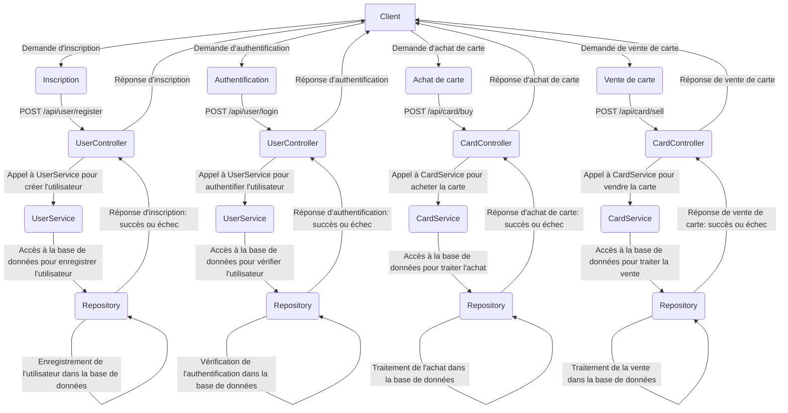

# Atelier2-SpringBoot

## Concepts :
Différentes architectures de conception logicielle
- MVC
- SOA
- MicroService

Avantages/inconvénients des architectures
- Services Web Full Rest
- Gestionnaires de dépendances (basique)

Techno :
- Maven
- Spring boot
- Javascript, AJAX

## Schéma de l'Architecture :

## Architecture Logicielle:

Frontend (JavaScript + AJAX) :
- Utilisera JavaScript pour la logique client.
- Les appels AJAX seront utilisés pour communiquer avec les services Web REST côté serveur.
- Interface utilisateur (UI) pour l'inscription, la connexion, l'achat et la vente de cartes.

## Backend (Spring Boot) :
Controllers :
- UserController : Gère les requêtes liées à l'inscription et l'authentification des utilisateurs.
- CardController : Gère les requêtes liées à l'achat et la vente de cartes.
    
Services :
- UserService : Contient la logique métier pour la création d'utilisateurs et la gestion de l'authentification.
- CardService : Gère la logique métier pour l'achat, la vente et la génération de cartes.

Repository :
Contient les interfaces pour interagir avec la base de données.

Base de Données :
  Stockage des informations sur les utilisateurs, les cartes disponibles, les transactions, etc.

## Avantages et Inconvénients de l'Architecture :
Avantages :
- Une structure bien organisée avec une séparation claire des préoccupations.
- Les controllers agissent comme des points d'entrée pour les requêtes HTTP et délèguent le travail aux services.
- Les services contiennent la logique métier, ce qui rend le code facilement testable et évolutif.
  
Inconvénients :
- Une gestion précise des dépendances entre les composants est nécessaire pour éviter les problèmes de dépendances circulaires.

## Détails de l'Implémentation :
- UserController :
  Endpoints pour l'inscription (POST /api/user/register) et l'authentification (POST /api/user/login).

- CardController :
  Endpoints pour acheter (POST /api/card/buy) et vendre (POST /api/card/sell) des cartes.

- UserService :
  Méthodes pour créer un utilisateur (registerUser) et authentifier un utilisateur (loginUser).

- CardService :
  Méthodes pour acheter (buyCard), vendre (sellCard) et générer automatiquement des cartes (generateCards).

